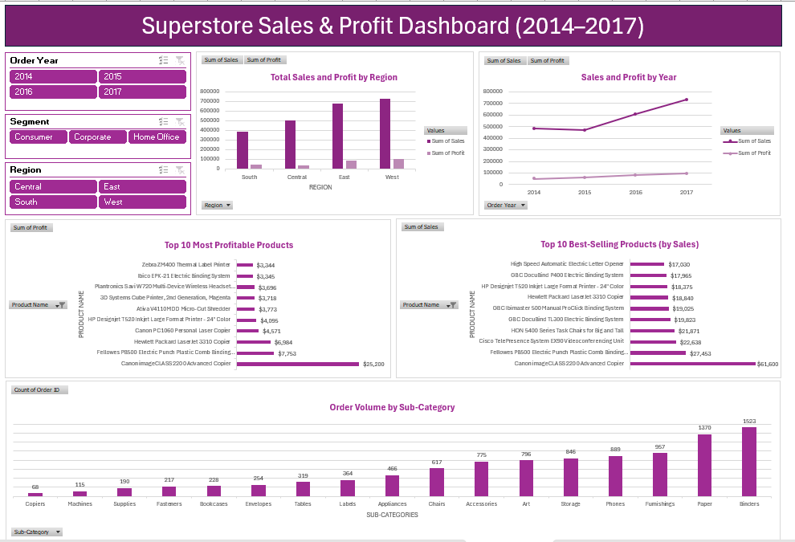

# 📊 Superstore Sales & Profit Dashboard (2014–2017)

This Excel dashboard presents a detailed analysis of sales, profit, and product performance using the **Sample - Superstore** dataset. The project was built entirely using **Pivot Tables**, **Pivot Charts**, and **Slicers** in Microsoft Excel, with a strong focus on data storytelling and visual design — no formulas used.

---

## 🖼️ Dashboard Preview

---

## 🧠 Business Questions Answered

1. ✅ What is the total sales, profit, and quantity sold per region?
2. ✅ Which are the top 10 best-selling products by sales?
3. ✅ Which are the top 10 most profitable products?
4. ✅ Which sub-category has the most orders?
5. ✅ Which year had the highest sales and profit?

---

## 💡 Key Features

- Clean and modern layout for quick interpretation
- Interactive **slicers** for filtering by:
  - **Order Year**
  - **Customer Segment**
  - **Region**
- Clear visual comparisons using bar charts, column charts, and line charts
- Strategic use of sorting, filters, and chart titles to improve data readability
- Fully functional dashboard — no macros, no formulas

---

## 📁 Files Included

| File | Description |
|------|-------------|
| `Superstore_Dashboard.xlsx` | The main Excel dashboard file |
| `dashboard-preview.png` | Screenshot of the completed dashboard |

---

## 🧼 Data Cleaning Summary

Before creating the dashboard:
- Removed full-row duplicates across all columns
- Standardized date formatting (`Order Date` and `Ship Date`)
- Ensured consistent column alignment and spacing
- Verified that all slicers and chart data sources were correctly mapped

---

## 🛠️ Tools & Skills Demonstrated

- Microsoft Excel (Pivot Tables & Pivot Charts)
- Slicer-based interactivity
- Dashboard layout design and storytelling
- Data cleaning and formatting basics 

---

## 👤 About Me

**MUHAMMEDBASHAR**  
Aspiring Data Analyst | Excel Enthusiast  
📫 muhammedbashar2003@gmail.com  
🔗 [LinkedIn: muhammed-bashar-b56770328](https://www.linkedin.com/in/muhammed-bashar-b56770328)

---

## 📌 Dataset Source

The dataset used is the public [Sample - Superstore](https://community.tableau.com/s/question/0D54T00000CWe4aSAD/sample-superstore), a fictional retail dataset widely used for learning data analytics and visualization techniques.

---

## ✅ How to Use This Project

1. Download the `Superstore_Dashboard.xlsx` file
2. Open in Microsoft Excel (2016 or newer)
3. Use the slicers to explore sales and profit insights by year, region, segment, etc.
4. View trends, top-performing products, and order volume by category

---

## 🎯 Project Objective

This dashboard project was created to demonstrate **core Excel dashboarding skills** with zero code or formula usage. It showcases the ability to structure, clean, and present data in an interactive and insightful way using only native Excel tools.

---
